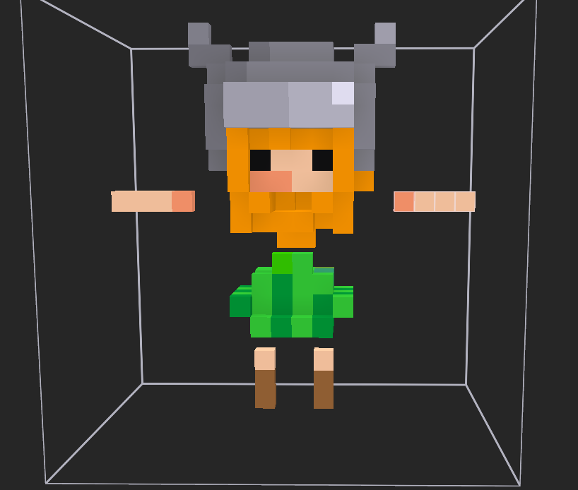

常用快捷键：
1. Shift + Z: 开启/关闭线框模式
2. Tab 键 进入/离开 Edit Mode
3. 
导入设置：
1. 推荐导入 ply 形式文件，这个文件默认不带贴图，但是可以通过在 Shader 中引用顶点颜色来获得模型颜色
2. 在制作人物模型时最好将各个关节都分开来建模，防止某些关节顶点不够用导致动画变得扭曲
3. 
4. 移除不必要的顶点：按下 Tab 键进入 Edit Mode, 然后按下 a 键全选所有模型，再按下 m 键选择 By Distance
5. 合并模型，在 Edit Mode，按下 Shift + 鼠标拖拽选中需要移动的方块，按下 Ctrl 键再进行拖拽可以每次移动一个格子，方便放置到合适的位置上
6. 然后进入 Shading 界面
7. 创建一个新的材质
8. 在材质编辑器界面空白区域点击 Shift + a，添加一个顶点色节点
9. 完成后回到 Layout 界面
10. 检查模型中心点
11. 如果有，那么进入到 Edit Mode，选择两个合适的点作为参考，然后按下 Shift + s，进入导航界面，点击数字键2（Cursor to Selected），让光标位于两点的中点。然后回到 Object Mode （按下 Tab），在保证全选模型的情况下，点击鼠标右键，选择 Set Origin -> Origin to 3d cursor。最后点击 Alt + g，将模型移动到世界原点，最后再按一次 Shift + s，选择2
12. 参考 [[学习 Blender 骨骼动画]]
13. 点击右侧边栏选择 Scene -> Unit 调整 Unit Scale 为 0.01. 这是因为 Blender 默认尺寸是米，而UE中默认尺寸为里面，所以需要调整到跟UE一致。在调整完毕以后，点击左侧边栏中的一个像尺的图标，用来测量当前模型的大小，再进行调整。
14. 点击 n 可以通过数值来控制模型的位置，大小和旋转
15. **导入到UE** 时，对于 fbx 模型，如果想保留顶点色需要将 Vertex color import Option 改为 replace 模式，否则不会导入顶点色