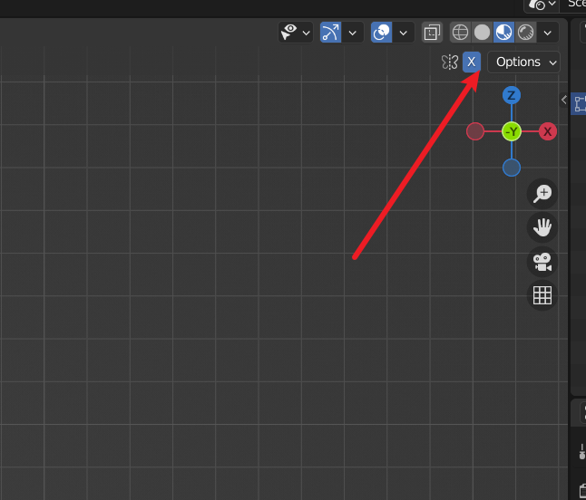
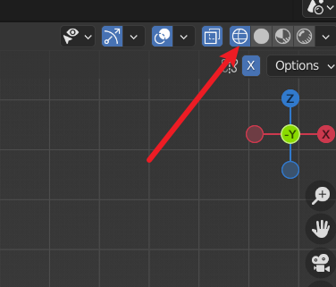
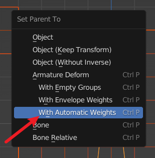
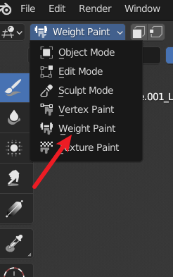

- 操作步骤
	1. 完成/导入建模之后，在 `Object Mode` 下按下 `A` 全选整个模型
	2. 按下 `Shift + A` 进入添加菜单
	3. 选择 Armature -> Single Bone 可以添加一根骨骼
		- 也可以选择其他选项获取 blender 以及提供的骨骼模板
	4. 在 Armature 界面将 Viewprot Display 中的 In Front 点上，这是为了让骨骼始终出现在物体之前，方便进行下一步骨骼编辑
	5. 骨骼编辑
		1. 首先进入 Edit Mode
		2. 鼠标点击选中骨骼
		3. 按下 G + (X, Y, Z) 代表沿着某一轴开始移动骨骼
		4. 选中骨骼顶端圆圈按下 e + (x, y, z) 可以扩展出新的骨骼，同时也表示这两个骨骼是相连的
		5. 
		6. 如上图所示，在制作手臂等部位的骨骼时点击此处开启镜像
		7. 按住 Shift + e 可以在开启镜像的情况下两边同时创建出骨骼
		8. 小提示，使用线框模式(ctrl + z)可以方便的查看骨骼关节是否放在了合适的位置
			
		9. 完成骨骼绑定后可以按下 Tab 按键进入到 Object Mode
		10. 此时选中模型同时按下 Shift 再次选中骨骼，然后按下 Ctrl + P 选择自动绑定骨骼权重
		
		12. 在 Object Mode 下选中骨骼后再次按住 Shift 选中模型，点击下图所示按钮可以进入到骨骼权重编辑界面
		13. 
		14. 在权重编辑中按住 Ctrl 点击需要编辑的骨骼就可以进行该骨骼的权重绘制
		15. 打开动画编辑界面可以进行K帧
		16. 需要注意的是，在insert之前需要按A键全选骨骼，再按i键进行插入，否则只会插入当前操作的骨骼而不是全身
		17. 