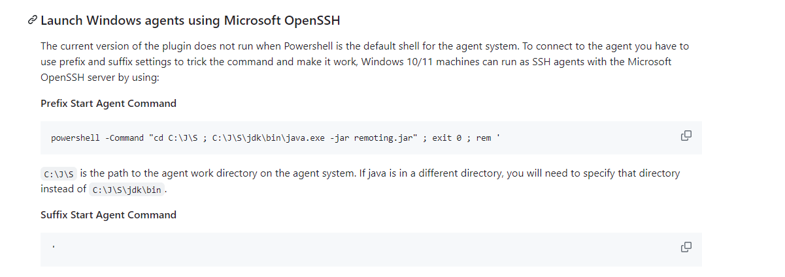

## 记录

1. 添加 jenkins 节点出现 `Error: Unable to access jarfile remoting.jar` 错误
- 解决方法：
    在节点配置中的 ssh 高级配置中
    `Prefix Start Agent Command` 填写 `powershell -Command "cd C:\J\S ; C:\J\S\jdk\bin\java.exe -jar remoting.jar" ; exit 0 ; rem '`  
    `Suffix Start Agent Command` 填写 `'`
- 原因：
    windows 中的路径分隔符是 `\`，而 jenkins 中的路径分隔符是 `/`，所以需要在 `Prefix Start Agent Command` 中使用 `powershell` 命令来切换目录，然后再执行 `java -jar remoting.jar` 命令。

