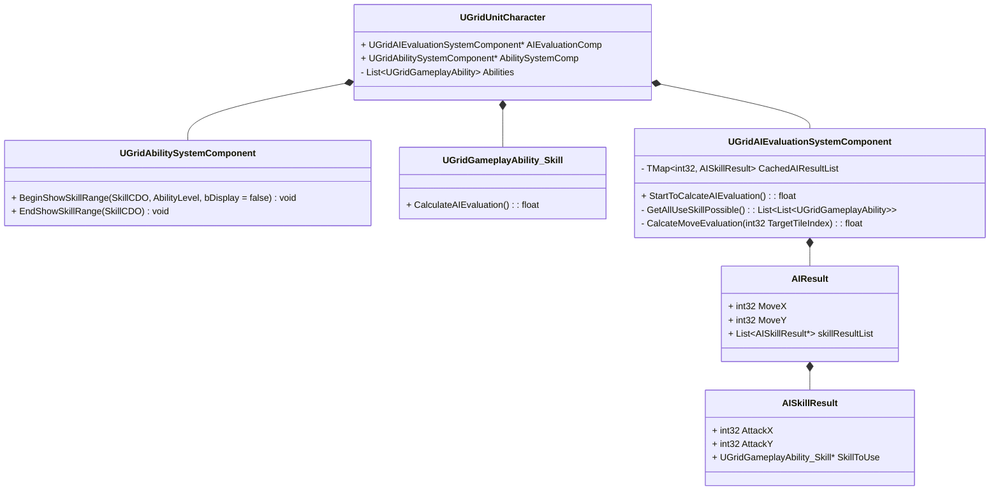

1. 伪代码
```C++
class AISkillResult {
public:
	int32 AttackX;
	int32 AttackY;
	
	UGridGameplayAbility_Skill* SkillToUse;
};
class AIResult {
public:
	int32 MoveX;
	int32 MoveY;

	List<AISkillResult*> skillResultList;
};
```

- 评价系统
	`UGridAIEvaluationSystemComponent`

> Tips
> 一点行动力 = 移动一格 = 造成 5 点伤害 = 1 点属性提升