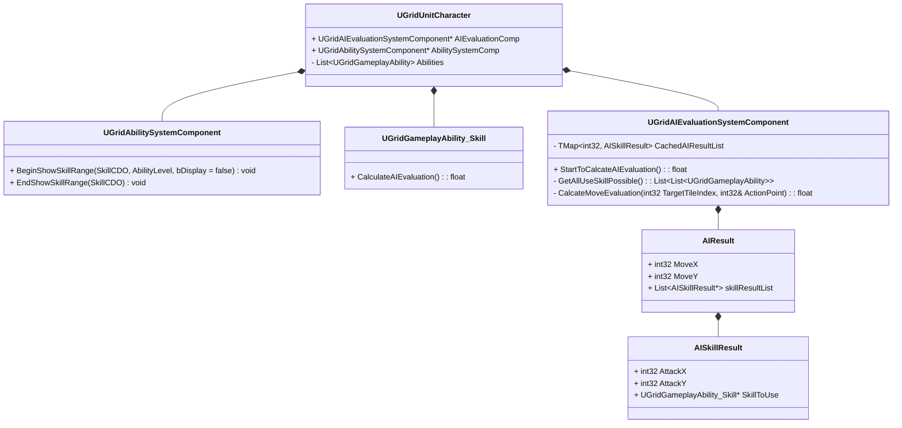

1. 伪代码
```C++
class AISkillResult {
public:
	int32 AttackX;
	int32 AttackY;
	
	UGridGameplayAbility_Skill* SkillToUse;
};
class AIResult {
public:
	int32 MoveX;
	int32 MoveY;

	List<AISkillResult*> skillResultList;
};
```

- 评价系统
	`UGridAIEvaluationSystemComponent`

> Tips
> CalcateMoveEvaluation：
> 	(1.0 -normalize(MoveCost)) + CalcateDistanceBetweenTargets()
> CalcateDistanceBetweenTargets:
		if self.health > value then
		flag = move to targets
		else then
		flag = away from targets
		end if
		distance weight coefficient = 0.0f;
		foreach all targets in gridmap
			distance = gridmap -> DistanceInTilesBetweenIndexes(targetIndex, target.tileIndex)
			if flag is move to targets 
				distance weight coefficient +=  1.0 - normalize(distance) * (target cause damage coefficient)
			if flag us away from targets 
				distance weight coefficient += normalize(distance)
		return distance weight coefficient
		