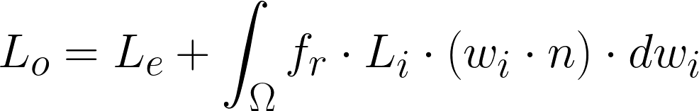
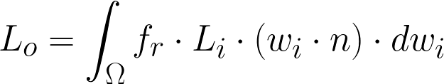
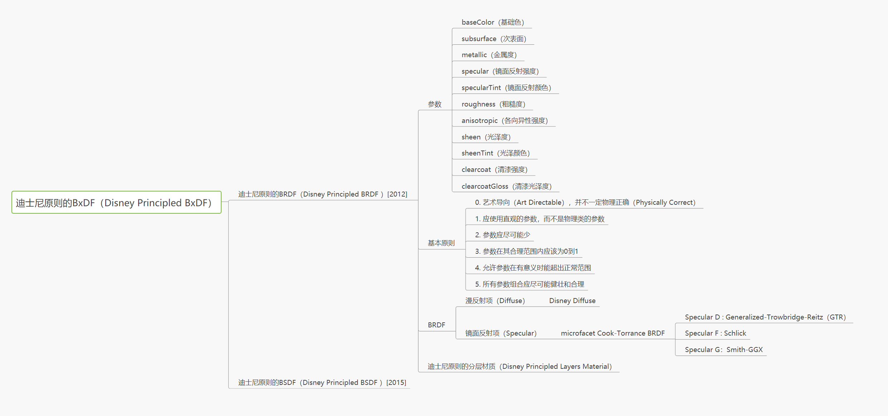

## 渲染方程
渲染方程的物理基础是能量守恒定律。在一个特定的位置和方向，出射光 Lo 是自发光 Le 与反射光线之和，反射光线本身是各个方向的入射光 Li 之和乘以表面反射率及入射角。

图1.1-渲染方程

其中：
- Lo：出射光强度，是最终需要渲染出来的颜色
- Le: 是该点处的自发光强度
- fr：是该点入射光强度到出射光的反射比例，通常被称为 BxDF
- (ωi,ωo)：是入射角带来的入射光衰减
- f...dωi：是对所有入射光方向半球积分，得到出射光强度

通常我们会忽略物体的自发光，因为大部分物体都是被其他光源照亮的，所以我们可以将渲染方程简化为： 

图1.2-渲染方程简化

其中：
- Le: 是该点处的自发光强度
- fr：是该点入射光强度到出射光的反射比例，通常被称为 BRDF(Bidirectional Reflectance Distribution Function)
- (ωi,ωo)：是入射角带来的入射光衰减
- f...dωi：是对所有入射光方向半球积分，得到出射光强度

## BxDF
一般而言，BxDF 是几种双向分布函数的统称，包括BRDF、BTDF、BSDF、BSSRDF  
其中 BRDF 更为常用，因为游戏中的大部分物体都是不透明的，而 BSDF、BSSRDF 等更适合半透明物体的渲染。  

图2.1-迪士尼原则的BxDF