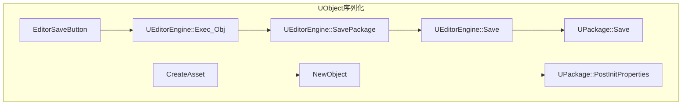

```mermaid
graph TB
subgraph UObject序列化
EditorSaveButton --> UEditorEngine::Exec_Obj
UEditorEngine::Exec_Obj --> UEditorEngine::SavePackage
UEditorEngine::SavePackage --> UEditorEngine::Save
UEditorEngine::Save --> UPackage::Save

CreateAsset --> NewObject
NewObject ---> UPackage::PostInitProperties

end
```